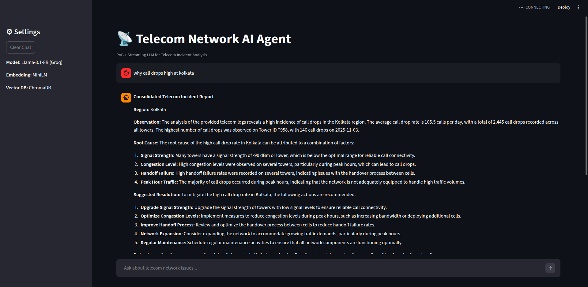

# Telecom AI Agent

A simple **RAG-based AI system** that analyzes telecom network logs and generates structured troubleshooting reports.

## Tech Stack

- Python
- Pandas
- Numpy
- ChromaDB
- Sentence Transformers
- Groq LLM (Llama 3.1)
- Streamlit

## Setup

1. Create virtual environment

```
python3 -m venv venv
source venv/bin/activate
```

2. Install dependencies

```
pip install -r requirements.txt
```

3. Create embeddings

```
python scripts/03_store_chroma.py
```

4. Run the application

```
streamlit run app.py
```

## Example Query

Why call drops high at kolkata?

## Output Format

- Region
- Observation
- Root Cause
- Suggested Resolution

## Application Screenshot



## Author

Sujit Pal
