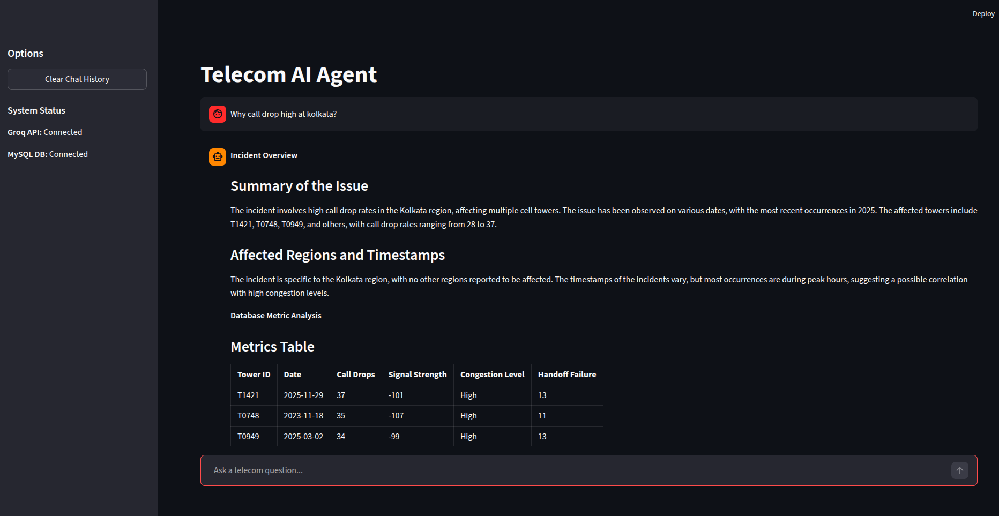

# Telecom AI Agent: Hybrid SQL & RAG System

An advanced, hybrid AI-powered Agent system designed for a Telecom Network Operations Center (NOC) to automate the root cause analysis (RCA) and resolution recommendations for network degradations and call drops.

The system integrates **structured database querying** (via dynamic Text-to-SQL execution on MySQL) and **unstructured semantic document retrieval** (via Retrieval-Augmented Generation using ChromaDB) to provide engineers with comprehensive, explainable troubleshooting reports.

---

##  Key Features

*   **Intent Guardrail Classifier:** Utilizes `llama-3.1-8b-instant` to analyze user queries and block off-topic inputs, ensuring the agent remains focused on telecom operations.
*   **Dynamic Text-to-SQL Engine:** Translates natural language queries into executable MySQL queries on-the-fly using `llama-3.3-70b-versatile` to query tabular network log metrics.
*   **Vector RAG Engine:** Queries a ChromaDB vector store using `all-MiniLM-L6-v2` embeddings to retrieve engineering guidelines related to weak signals, congestion, and handoff failures.
*   **Stateful Conversational Memory:** Summarizes the last two messages in the chat history using a lightweight model to maintain context across follow-up queries.
*   **Streamed Report Synthesis:** Synthesizes metrics and domain knowledge into a technical report (in markdown), complete with incident overview, metric tables, root causes, and parameter recommendations.

---

##  System Architecture & Workflow

```
                        +----------------------------+
                        |  User Query (Streamlit UI)  |
                        +--------------+-------------+
                                       |
                                       v
                        +----------------------------+
                        | Guardrail Classifier (8B)  |
                        +--------------+-------------+
                                       |
                       (Is Telecom-Related? Yes)
                                       |
              +------------------------+------------------------+
              |                                                 |
              v                                                 v
  +-----------------------+                         +-----------------------+
  |    SQL Data Engine    |                         |   Vector RAG Engine   |
  |                       |                         |                       |
  | - Text-to-SQL (70B)   |                         | - all-MiniLM-L6-v2    |
  | - Run MySQL Query     |                         | - ChromaDB Query      |
  | - Extract KPI logs    |                         | - Get Tech Guides     |
  +-----------+-----------+                         +-----------+-----------+
              |                                                 |
              +------------------------+------------------------+
                                       |
                                       v
                        +----------------------------+
                        |  Report Synthesizer (70B)  |
                        |                            |
                        | - Joins Metrics & Guides   |
                        | - Formats KPI Tables       |
                        | - Generates Recommendations|
                        +--------------+-------------+
                                       |
                                       v
                        +----------------------------+
                        | Streamed Markdown Report   |
                        +----------------------------+
```

---

##  Technology Stack

*   **Frontend UI:** Streamlit
*   **LLM API:** Groq (Llama 3.3 70B & Llama 3.1 8B)
*   **Embeddings Model:** HuggingFace `sentence-transformers/all-MiniLM-L6-v2`
*   **Vector Database:** ChromaDB
*   **Relational Database:** MySQL (accessed via SQLAlchemy & mysql-connector-python)
*   **Data Manipulation:** Pandas & NumPy

---

##  Project Structure

```
├── agent.py                 # Core TelecomHybridAgent class (Guardrails, SQL, RAG, and Report generation)
├── app.py                   # Streamlit interface with stateful session chat management
├── data/
│   ├── log/
│   │   └── dataset.csv      # Raw CSV network metrics log dataset
│   └── knowledge/           # Unstructured telecom troubleshooting manuals
│       ├── congestion.txt
│       ├── handoff.txt
│       ├── weak_signal.txt
│       └── recommendation.txt
├── docs/
│   ├── Problem_statement.docx
│   ├── ui.png               # Application UI screenshot
│   └── presentation.pptx    # University presentation slides (PowerPoint)
├── requirements.txt         # Project dependencies
├── scripts/
│   ├── db_ingest.py         # Script to clean raw logs and ingest into MySQL database
│   └── store_knowledge_chroma.py # Script to chunk, embed, and store domain knowledge in ChromaDB
├── vectorstore/             # Local persistent directory for ChromaDB collection
└── .env                     # Local environment file containing credentials (ignored by git)
```

---

## Setup & Execution

### 1. Environment Initialization
Clone the repository and create a Python virtual environment:
```bash
# Create virtual environment
python3 -m venv venv

# Activate virtual environment
source venv/bin/activate
```

### 2. Install Dependencies
```bash
pip install -r requirements.txt
```

### 3. Configure Environment Variables
Create a `.env` file in the root directory and populate it with your credentials:
```ini
# Groq API Key
GROQ_API_KEY=your_groq_api_key_here

# Database Configuration (MySQL)
DB_HOST=localhost
DB_PORT=3306
DB_USER=root
DB_PASSWORD=your_mysql_password
DB_NAME=telecom_db
```

### 4. Data Ingestion & Database Setup
Initialize both database components of the hybrid system:

*   **Ingest Tabular Metrics into MySQL:**
    ```bash
    python scripts/db_ingest.py
    ```
    This script cleans the raw dataset (`data/log/dataset.csv`), handles missing dates, standardizes signal strength and handoff failure formats, sets up the schema, and creates indexed tables in MySQL.

*   **Populate Unstructured Knowledge into ChromaDB:**
    ```bash
    python scripts/store_knowledge_chroma.py
    ```
    This script reads files in `data/knowledge/`, chunks them, generates embeddings using `all-MiniLM-L6-v2`, and persists the collection locally in `vectorstore/`.

### 5. Launch the Application
Run the Streamlit frontend:
```bash
streamlit run app.py
```

---

##  Example Query & Output



